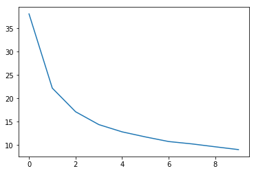

Extension to Pytorch tutorial's [Classifying Names with a Character-Level RNN](http://pytorch.org/tutorials/intermediate/char_rnn_classification_tutorial.html#classifying-names-with-a-character-level-rnn). The main purpose of this script is to demo batch bi-RNN on classification when input dataset has various length. 


```python
import torch
from torch.nn.utils import clip_grad_norm
from torch.nn.utils.rnn import pack_padded_sequence, pad_packed_sequence
from torch.optim.lr_scheduler import ReduceLROnPlateau
from torch.utils.data import DataLoader
from torch.utils import data
from torch.autograd import Variable
import torch.nn as nn
import glob, os, string
from sklearn.model_selection import StratifiedShuffleSplit
from sklearn.metrics import classification_report, confusion_matrix, accuracy_score
import matplotlib.pyplot as plt


all_letters = string.ascii_letters + ":.,-\n "
n_letters = len(all_letters)
path_to_files = "./data/names/*.txt"
torch.manual_seed(1)
```


    <torch._C.Generator at 0x29fe9cbb690>


## Prepare Data

### Process data into a long list [ (language name, country name),...]


```python
def load_data(path_to_files):
    files = glob.glob(path_to_files)
    country_name = [os.path.basename(file).split(".")[0] for file in files]
    name_data = []
    for file, file_name in zip(files, country_name):
        with open(file, 'r') as f:
            names = f.readlines()
        name_data += [(name.strip()+"\n", file_name) for name in names]
    return list(set(name_data)), country_name


```

### Convert characters into numbers 


```python
def prepare_idx(dat):
    to_ix = {k: v for v, k in enumerate(dat)}
    ix_to = {v: k for k, v in to_ix.items()}
    return to_ix, ix_to

def sort_batch_data(dat):
    # data: [[(name, target), len of name], ...]
    name, target = dat[0]
    length = dat[1]
    sorted_length, sorted_id = length.sort(dim=0, descending=True)
    sorted_name = name[sorted_id]
    sorted_target = target[sorted_id]
    return Variable(torch.t(sorted_name)), Variable(sorted_target).squeeze(), sorted_length
```

### Prepare dataset via Pytorch's DataLoader
1. Input data format: [ (language name, country name), ... ] 
2. Create two torch long tensor with zeros:
	character_tensor ( n samples, length of longest name)
	target_tensor  (n samples, 1)
3. Convert input data into both tensors. For example, if the longest name has length of 4, a name with length of 2 will be padded 2 zeros at the end. 


```python
class NameDataset(data.Dataset):
    def __init__(self, data, char_to_idx, target_to_idx):
        super(NameDataset, self).__init__()
        self.data = data
        self.names = [x[0] for x in data]
        self.targets = [x[1] for x in data]
        self.n_sampel = len(self.data)
        self.length = [len(x[0]) for x in self.data]

        self.char_to_idx = char_to_idx
        self.target_to_idx = target_to_idx
        self.char_tensor = torch.zeros((self.n_sampel, max(self.length))).long()
        self.target_tensor = torch.zeros((self.n_sampel, 1)).long()
        self.process_data()

    def process_data(self):
        for i in range(self.n_sampel):
            name, target = self.data[i]
            self.char_tensor[i, :self.length[i]] = self.convert_to_tensor(name, self.char_to_idx)
            self.target_tensor[i, :] = self.convert_to_tensor([target], self.target_to_idx)

    @staticmethod
    def convert_to_tensor(char, idx):
        return torch.LongTensor([idx[i] for i in char])

    def __getitem__(self, index):
        return [(self.char_tensor[index], self.target_tensor[index]), self.length[index]]

    def __len__(self):
        return len(self.data)
```

## The RNN Model:
1. Character level embedding 
2. LSTM or GRU: bi-directional with dropout rate of 0.7
3. Linear combination 
4. Sum over all character values
5. Softmax 
6. Gradient clipping
7. Adam optimization with L2 regularlization of 0.0005. Initial learning rate is 1e-3
8. Learning rate declinding scheme


```python
class RecurrentNet(nn.Module):
    def __init__(self, vocab_size, vocab_embed, hidden_dim, target_size, type):
        super(RecurrentNet, self).__init__()
        self.vocab_embed = vocab_embed
        self.hidden_dim = hidden_dim

        self.embed = nn.Embedding(vocab_size, vocab_embed)
        if type =='LSTM':
            self.rnn = nn.LSTM(vocab_embed, hidden_dim//2, num_layers=1, bias=True, bidirectional=True, dropout=0.7)
        elif type == 'GRU':
            self.rnn = nn.GRU(vocab_embed, hidden_dim//2, num_layers=1, bias=True, bidirectional=True, dropout=0.7)
        else:
            raise SyntaxError("Type Error. Either LSTM or GRU")
        self.type = type
        self.char_2_tag = nn.Linear(hidden_dim, target_size)
        self.softmax = nn.LogSoftmax(dim=1)

    def init_hidden(self, batch_size):
        if self.type == "LSTM":
            hidden_layers = (Variable(torch.zeros((2, batch_size, self.hidden_dim // 2))),
                             Variable(torch.zeros((2, batch_size, self.hidden_dim // 2))))
        elif self.type == 'GRU':
            hidden_layers = Variable(torch.zeros((2, batch_size, self.hidden_dim // 2)))
        return hidden_layers

    def forward(self, name_tensor, sorted_length):
        embed_name = self.embed(name_tensor)
        packed_name = pack_padded_sequence(embed_name, sorted_length.tolist())
        char_gru, char_hidden = self.rnn(packed_name, self.hidden)
        pad_char, _ = pad_packed_sequence(char_gru)
        target_space = self.char_2_tag(pad_char)
        target_space = target_space.sum(dim=0)
        target_score = self.softmax(target_space)
        return target_score

```

## Prepare train/dev/test data
The input data has various counts for each country, so I split it by weights of each country. 

Train: 80%  used to build the model

Dev : 10%  used to configure model parameters

Test : 10% test


```python
def split_data(data, test_size=0.2, train_size=0.8, random_state=1):
    splitter = StratifiedShuffleSplit(test_size=test_size,
                                      train_size=train_size,
                                      random_state=random_state)
    y_true = [x[1] for x in data]
    for train_index, test_index in splitter.split(data, y_true):
        train = [data[i] for i in train_index]
        test = [data[i] for i in test_index]
    return train, test
```


```python
name_data, countries = load_data(path_to_files)
print(name_data[:5])
print(countries[:5])

```

    [('Finnimore\n', 'English'), ('Hinds\n', 'English'), ('Tai\n', 'Chinese'), ('Exton\n', 'English'), ('Miyamae\n', 'Japanese')]
    ['Arabic', 'Chinese', 'English', 'Japanese', 'Korean']
    


```python
train, test_ = split_data(name_data, test_size=0.2, train_size=0.8, random_state=1)
print("Length of training set {}".format(len(train)))
```

    Length of training set 4084
    


```python
dev, test = split_data(test_, test_size=0.5, train_size=0.5, random_state=2)
print("Length of dev set {};\nlength of test set {}.".format(len(dev),len(test)))
```

    Length of dev set 511;
    length of test set 511.
    


```python
char_to_ix, ix_to_char = prepare_idx(all_letters)
target_to_ix, ix_to_target = prepare_idx(countries)

batch_size = 64
```


```python
train_set = NameDataset(train, char_to_ix, target_to_ix)
train_data = DataLoader(train_set, batch_size, shuffle=True)

dev_set = NameDataset(dev, char_to_ix, target_to_ix)
dev_data = DataLoader(dev_set, batch_size, shuffle=True)

test_set = NameDataset(test, char_to_ix, target_to_ix)
test_data = DataLoader(test_set, len(test), shuffle=True)
```

To speed up backprop, I clip gradientss that are larger than 10 and add a learning rate declinding scheme.


```python
vocab_size = len(char_to_ix)
target_size = len(target_to_ix)
vocab_embed = 80
hidden_dim = 60
iterations = 10

model = RecurrentNet(vocab_size, vocab_embed, hidden_dim, target_size, "LSTM")
loss_fn = nn.CrossEntropyLoss()
optimizer = torch.optim.Adam(model.parameters(), lr=1e-3, weight_decay=0.0005)
optim_scheduler = ReduceLROnPlateau(optimizer, mode='min', factor=0.1, verbose=True, patience=1)
loss_cache = []

```


```python
for i in range(iterations):
    total_loss = []
    for batch_data in train_data:
        name, target, length = sort_batch_data(batch_data)
        batch_size = len(length)
        model.zero_grad()
        model.hidden = model.init_hidden(batch_size)
        target_score = model(name, length)
        loss = loss_fn(target_score, target)
        loss.backward()
        clip_grad_norm(model.parameters(), max_norm=10)
        optimizer.step()
        total_loss.append(loss.data[0] * batch_size)
    loss_avg = sum(total_loss) / len(total_loss)
    optim_scheduler.step(loss_avg)
    print("Epoch {} : {:.5f}".format(i+1, loss_avg))
    loss_cache.append(loss_avg)
```

    Epoch 1 : 38.08849
    Epoch 2 : 22.18404
    Epoch 3 : 17.12583
    Epoch 4 : 14.36953
    Epoch 5 : 12.81506
    Epoch 6 : 11.73068
    Epoch 7 : 10.74078
    Epoch 8 : 10.23288
    Epoch 9 : 9.61407
    Epoch 10 : 9.01092
    

### Learning Curve:


```python
plt.plot(loss_cache)

```


    [<matplotlib.lines.Line2D at 0x29fecb6d048>]





### Evaluation
Main metric is average accuracy. Additional scores such as F1 and confusion matrix are used to analysis error. 


```python
def evaluation(data):
    # post-process data from data loader
    target_pred = []
    target_true = []
    for batch_data in data:
        name, target, length = sort_batch_data(batch_data)
        batch_size = len(length)
        model.hidden = model.init_hidden(batch_size)
        target_score = model(name, length)
        score, category = torch.max(target_score, dim=1)
        target_pred += category.data.tolist()
        target_true += target.data.tolist()
    return target_pred, target_true
```

#### Training Data Result


```python
target_pred, target_true = evaluation(train_data)
accuracy = accuracy_score(target_true, target_pred)
print("Accuracy rate is {:.4f}".format(accuracy))
```

    Accuracy rate is 0.9591
    


```python
report = classification_report(target_true, target_pred, target_names=list(target_to_ix))
print(report)

error_matrix = confusion_matrix(target_true, target_pred)
print("M_{i,j} where i is true group and j is predicted group\n")
print(list(target_to_ix))
print(error_matrix)

y_true = [ix_to_target[i] for i in target_true]
y_pred = [ix_to_target[i] for i in target_pred]
```

                 precision    recall  f1-score   support
    
         Arabic       0.76      0.43      0.55        86
        Chinese       0.77      0.91      0.84       197
        English       0.98      0.99      0.98      2934
       Japanese       0.98      0.96      0.97       792
         Korean       0.66      0.44      0.53        75
    
    avg / total       0.96      0.96      0.96      4084
    
    M_{i,j} where i is true group and j is predicted group
    
    ['Arabic', 'Chinese', 'English', 'Japanese', 'Korean']
    [[  37    3   36    9    1]
     [   0  180    4    3   10]
     [   8   12 2905    5    4]
     [   3    7   18  762    2]
     [   1   32    8    1   33]]
    

#### Dev Data Result


```python
target_pred, target_true = evaluation(dev_data)
accuracy = accuracy_score(target_true, target_pred)
print("Accuracy rate is {:.4f}".format(accuracy))
```

    Accuracy rate is 0.9315
    


```python
report = classification_report(target_true, target_pred, target_names=list(target_to_ix))
print(report)

error_matrix = confusion_matrix(target_true, target_pred)
print("M_{i,j} where i is true group and j is predicted group\n")
print(list(target_to_ix))
print(error_matrix)

y_true = [ix_to_target[i] for i in target_true]
y_pred = [ix_to_target[i] for i in target_pred]
```

                 precision    recall  f1-score   support
    
         Arabic       0.50      0.27      0.35        11
        Chinese       0.59      0.83      0.69        24
        English       0.98      0.98      0.98       367
       Japanese       0.92      0.93      0.92        99
         Korean       0.33      0.20      0.25        10
    
    avg / total       0.93      0.93      0.93       511
    
    M_{i,j} where i is true group and j is predicted group
    
    ['Arabic', 'Chinese', 'English', 'Japanese', 'Korean']
    [[  3   0   4   4   0]
     [  0  20   1   1   2]
     [  1   4 359   1   2]
     [  2   4   1  92   0]
     [  0   6   0   2   2]]
    

#### Test Data Result


```python
target_pred, target_true = evaluation(test_data)
accuracy = accuracy_score(target_true, target_pred)
print("Accuracy rate is {:.4f}".format(accuracy))
```

    Accuracy rate is 0.9335
    


```python
report = classification_report(target_true, target_pred, target_names=list(target_to_ix))
print(report)

error_matrix = confusion_matrix(target_true, target_pred)
print("M_{i,j} where i is true group and j is predicted group\n")
print(list(target_to_ix))
print(error_matrix)

y_true = [ix_to_target[i] for i in target_true]
y_pred = [ix_to_target[i] for i in target_pred]
```

                 precision    recall  f1-score   support
    
         Arabic       0.50      0.18      0.27        11
        Chinese       0.71      0.80      0.75        25
        English       0.96      0.98      0.97       367
       Japanese       0.93      0.96      0.95        99
         Korean       0.33      0.22      0.27         9
    
    avg / total       0.93      0.93      0.93       511
    
    M_{i,j} where i is true group and j is predicted group
    
    ['Arabic', 'Chinese', 'English', 'Japanese', 'Korean']
    [[  2   0   7   2   0]
     [  0  20   2   0   3]
     [  1   2 358   5   1]
     [  1   0   3  95   0]
     [  0   6   1   0   2]]
    
