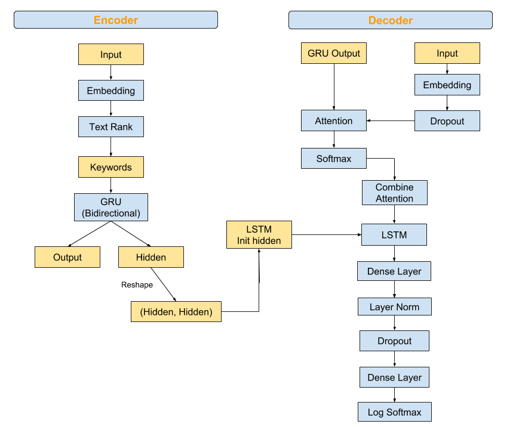

# Seq2Seq with Attention on Chinese Poetry Generation

1. Use skipgram model to generate word embedding

2. Use the Text Rank algorithm with embedding weights to select 2 important words

3. Pad poetry into batch and fit into a GRU as an Encoder

4. Dump the output & hidden states into a LSTM with dense output layer

## Model Structure 
The structure are modified from Pytorch tutorial on [Translation with a Sequence to Sequence Network and Attention](https://pytorch.org/tutorials/intermediate/seq2seq_translation_tutorial.html#evaluation). The attention model is simplified from _Chinese Poetry Generation with Planning based Neural Network_ by Wang, He, Wu, etc. 

I use a GRU in the encoder and a LSTM in the decoder, and I treat them as block boxes without modification. The output of GRU is used for the attention model for two reasons: looping over each sequence step in Pytorch is around 10x slower compared to the one step computation; GRU's output activation is tanh and its hidden state is a linear combination of previous output state.

The input data is a padded matrix: batch size x 100. Each row is a poetry and has the same format: ```title \<SOP> context \<EOP> (with punctuations)```, and the length is capped at 100 words. Shorter poetry are padded by 0 at the end.  



* note: Dense layers use SELU activation. Dropout rates are 50%.


## Procedure

### Word2Vec
I code skip gram with negative sampling from scratch . The main model structure is two word embedding. Word2vec model can be viewed as a standard two-layer neural net. The hidden layer transforms the input one-hot word vectors into word embedding vectors, and the output layer is used to predict words during training only. Using two word embedding for the output layer might be faster than the linear dense layer (not tested) because Pytorch's matrix-matrix product (```bmm```) function is optimized. 

The input data are pre-processed at the poetry level, so the combination of a content word and a target word comes from the same poetry.

Training time is around 11 hours per epoch in Nvidia K-80 in Google's Collaborator and around 24 hours in CPU-only environment. 
 
```angular2html
# model_negative_sampling.py

class SkipGramNegaSampling(nn.Module):
    def __init__(self, vocab_size, embed_dim):
        super(SkipGramNegaSampling, self).__init__()
        self.embed_hidden = nn.Embedding(vocab_size, embed_dim, sparse=True)
        self.embed_output = nn.Embedding(vocab_size, embed_dim, sparse=True)
        self.log_sigmoid = nn.LogSigmoid()

    def forward(self, input_batch, negative_batch):
        # input_batch (N x 2) [x, y]
        # negative_batch (N x k)
        x, y = input_batch
        embed_hidden = self.embed_hidden(x)  # N x 1 x D
        embed_target = self.embed_output(y)  # N x 1 x D
        embed_neg = -self.embed_output(negative_batch)  # N x k x D
        positive_score = embed_target.bmm(embed_hidden.transpose(1, 2)).squeeze(2)  # N x 1
        negative_score = embed_neg.bmm(embed_hidden.transpose(1, 2)).squeeze(2).sum(dim=1, keepdim=True)  # N x 1

        loss = self.log_sigmoid(positive_score) + self.log_sigmoid(negative_score)
        return -torch.mean(loss)
```

 But for efficient, I then use Gensim to generate the word embedding. I am not able to obtain the loss for each iteration. 
 If I loop over the model and manually decrease the learning rate, the loss from ```get_latest_training_loss``` differs significantly from the origin.  Hierarchical softmax is about 4-5x faster than negative sampling in Gensim.
 
 ```angular2html
# word2vec_gensim.py

word2vec_params = {
    'sg': 1,  # 0 ： CBOW； 1 : skip-gram
    "size": 300,
    "alpha": 0.01,
    "min_alpha": 0.0005,
    'window': 10,
    'min_count': 1,
    'seed': 1,
    "workers": 6,
    "negative": 0,
    "hs": 1,  # 0: negative sampling, 1:Hierarchical  softmax
    'compute_loss': True,
    'iter': 50,
    'cbow_mean': 0,
}

with open('./data/poetry.json', 'rb') as f:
    sentences = json.load(f)

model = Word2Vec(**word2vec_params)
model.build_vocab(sentences)
trained_word_count, raw_word_count = model.train(sentences, compute_loss=True,
                                                 total_examples=model.corpus_count,
                                                 epochs=model.epochs)
```
 
 ## Reference
* Pytorch tutorial on [Translation with a Sequence to Sequence Network and Attention](https://pytorch.org/tutorials/intermediate/seq2seq_translation_tutorial.html#evaluation)

* Chinese Poetry Generation with Planning based Neural Network by Wang, He, Wu, etc